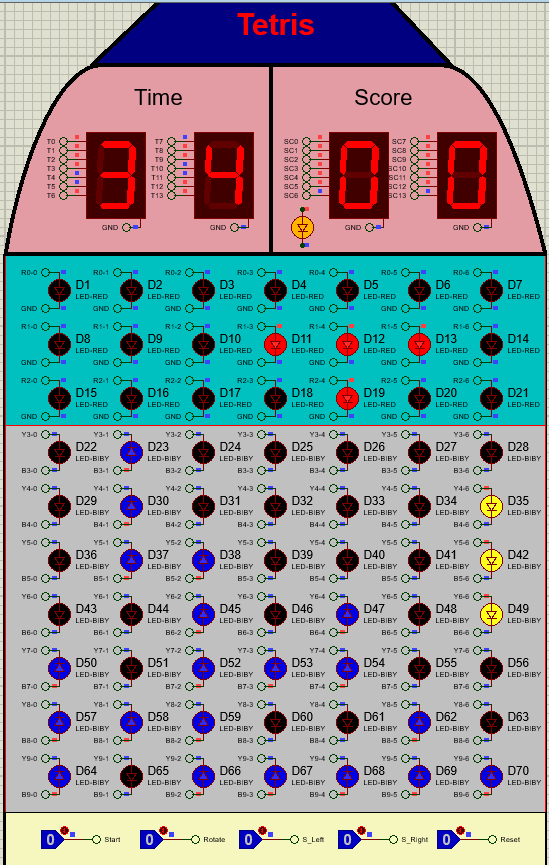
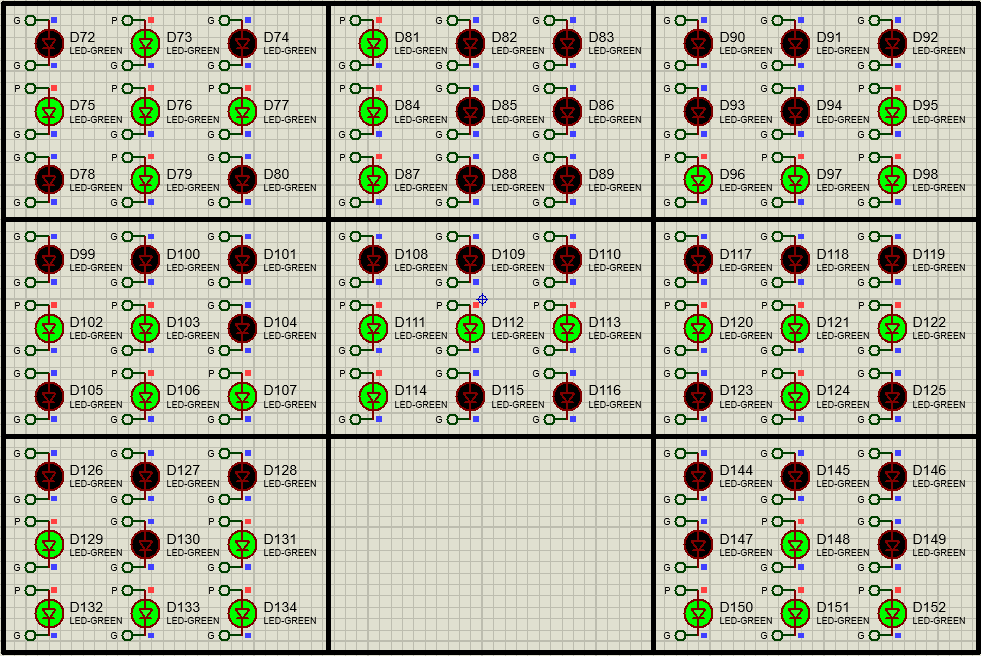
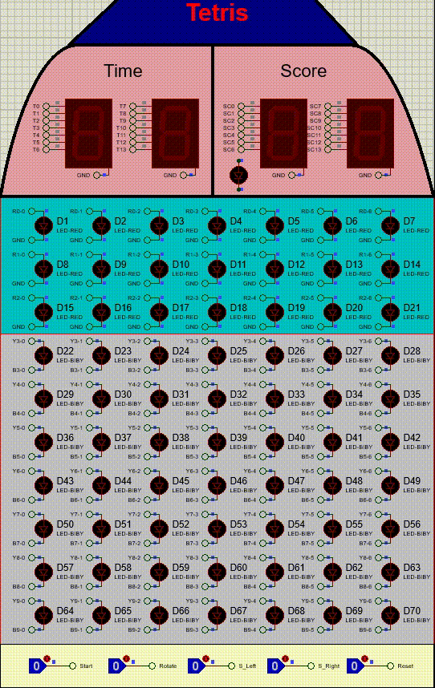
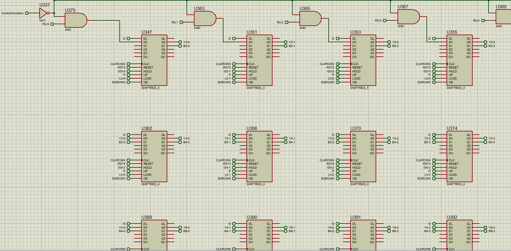

<h3 align="center">Tetris (Digital Circuits Project Implemented In Proteus) </h3>

## Introduction
This game is a digital block-stacking puzzle where the player's goal is to strategically guide and align falling blocks to complete rows within a limited time. The game is played on a 10x7 matrix, with blocks randomly generated in the top three rows. Players can control the position and orientation of these blocks using shift and rotation keys.

As rows are completed, they will flash for two seconds before being cleared, causing all blocks above them to shift downward. Players earn points for each cleared row, with the aim of reaching a total of three points to win the game. However, the game ends if:

- A block collides with a fixed block in the top three rows and cannot move out of the area.
- The timer reaches 99 seconds. 

<b>This document explains the overall project, the idea behind its implementation, and the functionality of each section.</b>



## Table of Contents

- [Gameplay Overview](#gameplay-overview)
  - [General Rules and Interface Setup](#general-rules-and-interface-setup)
  - [Starting the Game](#starting-the-game)
  - [Player Interactions](#player-interactions)
  - [Objective of the Game](#objective-of-the-game)
  
- [Implementation Idea](#implementation-idea)
  - [Before Game Starts](#before-game-starts)
  - [Game State Management](#game-state-management)
  - [Game End Condition](#game-end-condition)
  - [Timer and Score](#timer-and-score)
  - [Generating and Placing a Random 3x3 Block in the Game](#generating-and-placing-a-random-3x3-block-in-the-game)
  - [Control Generated Block](#control-generated-block)
  - [Downward Shift of the Generated Block](#downward-shift-of-the-generated-block)
  - [Block Collision](#block-collision)
  - [Gaining Score](#gaining-score)
  - [Fullboard Condition](#fullboard-condition)
  - [Notes](#notes)
- [Installation](#installation)
- [Running the Game](#running-the-game)
- [Resources](#resources)
- [License](#license)
- [Contact](#contact)


## Gameplay Overview

### General Rules and Interface Setup
The game interface consists of a 10x7 grid of LED, four seven segments responsible for displaying time and score, and five control buttons which are Start, Reset, Rotate, S_Right, and S_Left.

In the interface, each LED can either be on or off. When lit, the LEDs in the first three rows are red, while the LEDs in rows four to ten can be either yellow or blue.

Yellow LEDs indicate a moving block, whereas blue LEDs represent a fixed block. If any part of a moving block collides with the bottom of the grid or a fixed block, the entire moving block becomes fixed at the collision point.

#### End Condition:

**Winning Condition:** The player wins by successfully collecting 3 points.

**Losing Conditions:**
1. The player loses if a generated block collides with a fixed block while exiting the top 3 rows and cannot fully leave the area.
2. The player loses if the game time reaches 99 seconds.

### Starting the Game

After pressing the start button, the game begins, and the time and score values on the 7-segment displays reset to zero. One of the eight predefined 3x3 blocks is randomly generated and placed in a random position within the top three rows. (All eight predefined 3x3 blocks are displayed in the picture below.) 



For the first three seconds, while the block is still in the top three rows, the player can use the shift and rotate buttons to change the block's position and orientation. Once the block completely moves out of the top three rows, a new block is generated, and this process continues until the game ends.

### Player Interactions

- **Reset:** Clicking this option resets the game and user interface to a ready state.

- **Start:** Clicking this option starts the game, resets the score and time displays to zero, and initiates the random generation of blocks. This button is only active when the game has been reset and is ready to start.

- **Rotate:** When this key is pressed, the block in the top three rows rotates counterclockwise.

- **S_Right:** When the key is pressed, the block in the top three rows shifts right, if possible.

- **S_Left:** When the key is pressed, the block in the top three rows shifts left, if possible.

### Objective of the Game

The objective of the game is to arrange the blocks so they align in a single row. When a row of LEDs is completed, all the LEDs in that row will blink for two seconds before turning off. After that, all the blocks above the completed row will shift downward, and the player will receive one point added to their total score. The player wins by accumulating 3 points.

# Implementation Idea

## Before Game Starts
After running the simulation and before pressing the start button, the last two digits of the student ID numbers of the two project group members will alternately blink on the four 7-segment displays.

At the same time, the LEDs on the game matrix will illuminate in a spiral pattern from top to bottom, creating an effect similar to a light show. Please see the video below for a demonstration. This adds a visually engaging prelude to the game.



> [!NOTE] 
>
> To simplify and enhance understanding, from now on we will  refer to 'LEDs' as 'lights'.
>

Our implementation approach for this section is clear and systematic:

### Blinking Student ID Digits on 7-Segment Displays

**BCD to 7-Segment Conversion:**

To display the digits of student IDs on four 7-segment displays, we connect a BCD-to-7-segment decoder to each display. The input to each decoder consists of the BCD representation of the corresponding digit from the student ID.

**Blinking Mechanism:**

The outputs of the decoders, which are connected to the 7-segment displays, pass through a tri-state buffer. The enable condition of the tri-state buffer is controlled by an AND gate that combines the following signals:

1. **Game Not Started:** This ensures that the blinking occurs only before the game begins.
2. **2 Hz Clock Signal:** This clock alternates the buffer's enable state every 0.5 seconds, toggling the display output on and off.

This setup creates a blinking effect on the digits of the 7-segment displays.

### Light Show (Spiral Pattern)

**Shift Registers for Light Control:**

We employ several shift registers to control the lights in a spiral pattern from top to bottom. The input to the serial shift registers is set to 1 to simulate sequentially lighting up each light.

**Operation:**

Before the game begins, the shift registers sequentially shift a '1' through the lights, creating the spiral lighting effect. Once all the lights are illuminated, the shift registers are reset, and the process repeats until the game starts.

**Condition for Operation:**

The shift registers remain active as long as the game has not started. Once the game begins, the enabling condition for the shift registers is invalidated, thus stopping the light show.

## Game State Management

To manage the state of the game, we utilize two variables: GameStartState and GameEndState. As their names suggest:

- **GameStartState = 1**: This indicates that the game has started, meaning the player has clicked the Start button.
- **GameEndState = 1**: This indicates that the game has ended, whether the player won or lost.

### Functionality of the States:

**GameStartState**:
- When the Start button is pressed, a value of 1 is loaded into the register associated with the GameStartState output.
- This register is reset only when the Reset button is pressed.

**GameEndState**:
- The value of GameEndState is determined by the XOR operation applied to two variables: GameWon and GameLost. 
- These variables are explained in further detail in the section on [Game End Conditions](#game-end-condition).

### Game State Table

| GameStartState | GameEndState | Description                                        |
|-----------------|---------------|----------------------------------------------------|
| 0               | X             | The game has not started.                         |
| 1               | 0             | The game has started but not yet ended.          |
| 1               | 1             | The game has started and has ended.              |

### Controlling Circuit Activities

Using these two variables (GameStartState and GameEndState), we can effectively control the operation of the circuits for each part of the game:

- **When GameStartState = 0**, pre-start behaviors such as a blinking display and light show are active.
- **When GameStartState = 1** and GameEndState = 0, the game logic, block movement, and player interactions are active.
- **When GameEndState = 1**, post-game behaviors, such as displaying results, can be triggered.

This modular approach ensures clear control over the different stages of the game.

## Game End Condition
To track whether the player has won or lost, we define two variables: **GameWon** and **GameLost**. These variables indicate the player's win or loss status and are stored in a register. Here’s how their values are managed:

### Reset Condition
Both variables are reset to 0 when the **Reset** button is pressed.

### Load Condition
- **GameWon** is set to 1 when the **WinGame** signal is activated.
- **GameLost** is set to 1 when the **LoseGame** signal is activated.

These signals are generated based on the game's win and loss conditions.

### Win Condition
The player wins if they collect 3 points.

The player's score is displayed on the interface using two 7-segment displays, representing the score as an 8-bit BCD (Binary-Coded Decimal) value.

A comparator circuit compares this 8-bit BCD value with **0110** (the binary representation of 3). If the comparator output indicates "greater than or equal to 3," the **WinGame** signal is set to 1. This activates the **GameWon** variable, marking the game as won and ending it.

### Loss Conditions

A player loses the game if either of the following conditions is met:

**Collision in the Top 3 Rows (FullBoard Condition):**

If a newly generated 3x3 block collides with a fixed block and cannot completely move out of the top three rows, a variable named **FullBoard** is set to 1. 

When **FullBoard** equals 1, the **LoseGame** signal is triggered, which sets **GameLost** to 1 and ends the game. 

Details on how **FullBoard** is determined can be found in the [FullBoard Condition](#fullboard-condition) section.

### Timer Reaches 99 Seconds

The game timer is represented as an 8-bit BCD (Binary-Coded Decimal) value. To detect when the timer reaches 99 seconds, the following condition is checked:

```
If we let eight BCD Timer bits be T0...T7:
( (T0)AND(NOT(T1))AND(NOT(T2))AND(T3) ) 
AND
( (T4)AND(NOT(T5))AND(NOT(T6))AND(T7) )
```

If this condition evaluates to true, the `LoseGame` signal is triggered, resulting in `GameLost` being set to 1 and the game ending.

### Combining Loss Conditions

The `LoseGame` signal is determined based on the following conditions:

```
LoseGame = FullBoard OR (BCD Timer AND 1001 1001)
```

This means the game will be marked as lost if either the board is full or the timer has reached 99 seconds.

To ensure these loss conditions only apply after the game has started, we finalize the `LoseGame` condition by ANDing it with the `GameStartState`:

```
LoseGame = (FullBoard OR (BCD Timer AND 1001 1001)) AND GameStartState
```

### Summary of Logic

| Condition                    | Signal Triggered      | Result                            |
|------------------------------|----------------------|-----------------------------------|
| Score >= 3                   | WinGame = 1         | GameWon = 1 (End Game)           |
| Collision in top 3 rows      | FullBoard = 1       | GameLost = 1 (End Game)          |
| Timer reaches 99 seconds     | Timer AND 1001 1001 | GameLost = 1 (End Game)          |

## Timer and Score

To display the game timer and player score, we use four 7-segment displays, each driven by a Binary-Coded Decimal (BCD) value since humans naturally count in base-10. Below is a detailed implementation:

### Game Timer

The game timer counts the elapsed seconds and is displayed as two digits:

- **Units Place (0–9):** Controlled by Counter A.
- **Tens Place (0–9):** Controlled by Counter B.

**Implementation of Timer Counters**

**Counter A (Units):**

- **Clock Input:** A 1 Hz clock signal serves as the input.
- **Operation:** 
  - Counter A increments from 0 to 9.
  - When it reaches 9, it resets to 0 on the next clock edge.
  - When Counter A resets, Counter B increments by 1.

**Counter B (Tens):**

- **Clock Input:** Triggered whenever Counter A resets after reaching 9.
- **Operation:**
  - Counter B increments from 0 to 9.

**Output:**

The combined output of Counter A and Counter B forms an 8-bit BCD value representing the timer:

**Timer Output = Counter B (MSB) | Counter A (LSB)**

**Connection to 7-Segment Displays:**

The 8-bit BCD output is sent to BCD-to-7-segment decoders. To control when the timer is displayed, we use tri-state buffers with the following enable condition:

```
GameStartState AND NOT(GameEndState)
```

This condition ensures the timer is displayed only when the game is active (i.e., when it has started but not yet ended).

### Player Score

The player score is displayed using a similar structure to the timer, with a few key differences:

**Clock Input for Counter A (Units):**

- Instead of a 1 Hz clock, Counter A utilizes a signal known as AddScore as its clock input.

**AddScore:**
- The AddScore signal becomes active (1) whenever the player successfully clears a complete row of lights.
- Further details about this signal are provided in the [Gaining Score](#gaining-score) section.

**Operation:**
- Counter A increments each time it receives an AddScore pulse.
- When Counter A reaches a value of 9, it resets to 0 and increments Counter B, similar to how the timer counters operate.

**Output and Display:**
- The combined output of Counter A and Counter B forms the 8-bit BCD (Binary-Coded Decimal) score value.
- This output is sent to the BCD-to-7-segment decoders, which are controlled by tri-state buffers. The enable condition for these buffers is the same as that for the timer: 
```
GameStartState AND NOT(GameEndState)
```
This ensures a clear and logical display of the game timer and player score.

## Generating and Placing a Random 3x3 Block in the Game

To create and position a random 3x3 block on the game board, we utilize a Linear-Feedback Shift Register (LFSR) to generate 6 pseudo-random bits. These bits determine both the shape and position of the block.

### Generating the Random Bits

**LFSR for 6-Bit Output:**

The LFSR continuously generates a 6-bit pseudo-random sequence. When the block generation conditions are met, the current output of the LFSR is stored in a register to ensure stability for subsequent block generation.

**Block Generation Conditions:**

A block is generated only when the following conditions are met:

1. All lights in the top 3 rows are off (indicating that the last generated 3x3 block has completely left this area or simply the game just started).
2. `GameStartState = 1` (the game has started).
3. `GameEndState = 0` (the game has not ended).

These conditions ensure that blocks are created only when the game is active and there is space to place a new block.

### Using Random Bits to Determine the Block Shape

**Block Shape Selection:**

The 3 most significant bits (MSBs) of the LFSR output are used as a selector for an 8-to-1 multiplexer. This multiplexer has 8 inputs, each representing one of the predefined 3x3 block shapes, as follows:

1. 010 111 010  
2. 100 100 100  
3. 000 001 111  
4. 000 110 011  
5. 000 111 100  
6. 000 111 010  
7. 000 101 111  
8. 000 010 111  

Each shape is represented by 9 bits (3 bits per row). The output of the multiplexer (9 bits) is stored in variables: `SHAPE0`, `SHAPE1`, ..., `SHAPE8`.


### Using Random Bits to Determine Block Position

#### Block Positioning:
The three least significant bits (LSBs) of the Linear Feedback Shift Register (LFSR) output are utilized as inputs to a 3-to-8 decoder. This decoder determines which three adjacent columns on the game board the block will occupy.

#### Mapping Decoder Outputs to Positions:
Given that the game board consists of seven columns, the possible positions are as follows:

- **POS0-2**: Columns 0, 1, 2
- **POS1-3**: Columns 1, 2, 3
- **POS2-4**: Columns 2, 3, 4
- **POS3-5**: Columns 3, 4, 5
- **POS4-6**: Columns 4, 5, 6

To account for the eight decoder outputs, the outputs corresponding to positions 5, 6, and 7 are merged with the first five positions using OR gates. This ensures that only valid positions are generated, increasing the likelihood of placing blocks further away from the board edges.

#### Connecting to Buffers:
For each position (POS0-2, POS1-3, ..., POS4-6), a 9-bit tri-state buffer is employed. The enable condition for each buffer corresponds to its respective POS signal. The output of the buffer is then connected to the appropriate columns on the game board.

**Process Summary**

**Shape Selection:**  
The top 3 bits of the LFSR output are used to select one of the predefined 8 shapes through an 8-to-1 multiplexer.

**Position Selection:**  
The bottom 3 bits of the LFSR output determine the position of the block using a 3-to-8 decoder.

**Block Placement:**  
The selected shape, which consists of 9 bits, is routed through the corresponding position buffer. This enables the shape to control the lights in the specified 3 columns.

## Control Generated Block

After a block is generated, the player has three seconds to control it using the following actions:

- **Shift Right (S_Right)**
- **Shift Left (S_Left)**
- **Rotate (Rotate)**

### Shifting Left and Right

Each of the top three rows is managed by a separate 7-bit shift register. When a block is created, its shape data is initially stored in temporary variables, which are then loaded into these shift registers. This setup allows for future modifications, such as rotations, without directly altering the display registers.

#### To Shift the Block:

The shift registers move their bits to the left or right. 

The shift operation is clocked by the OR combination of S_Right, S_Left, Rotate, and CreationCondition signals.

The shift direction is determined by the order of temporary light variables as shift register inputs:

- **If left-to-right:** S_Right decides shift direction.

- **If right-to-left:** S_Left decides shift direction.

### Preventing Invalid Shifts

To ensure that a block does not shift out of bounds:

- **Shift Right** is permitted only if there are no active bits in the last column. This is verified using a NOR gate that checks the bits in the 7th column.
- **Shift Left** is permitted only if there are no active bits in the first column. This is verified using a NOR gate that checks the bits in 1st column.

Both conditions are combined using an AND operation with the shift signals before execution. Additionally, shifts are allowed only while the ControlCondition signal is active, which means they can only occur within the three-second control window. So The previous output will be combined with **ControlCondition** using an AND operation.

**Shift Registers Clock Signal:**
```
(S_Left AND (L0-0 NOR L1-0 NOR L2-0) AND ControlCondition) OR 
(S_Right AND (L0-6 NOR L1-6 NOR L2-6) AND ControlCondition) OR
(Rotate AND ControlCondition) OR
CreationCondition
```
**Rotation Implementation**

Blocks can rotate counterclockwise in four states:

1. 0° (Initial State)
2. 90° Counterclockwise
3. 180° Counterclockwise
4. 270° Counterclockwise

A 2-bit counter tracks the rotation state (from 0 to 3). Each time a Rotate signal is received, the counter increments, looping back to 0 after reaching 3.

A 2-to-4 decoder maps the counter value to one of four 9-bit tri-state buffers, each storing the block's shape in the correct rotated orientation. The rotations follow this pattern:

**Initial Shape (0°):**

```
1 2 3
4 5 6
7 8 9
```

**After 90° Counterclockwise Rotation:**

```
3 6 9
2 5 8
1 4 7
```

Each further 90° rotation applies the same transformation. The new rotated shape is stored in temporary variables before being loaded into shift registers, ensuring seamless display updates.

**Center of Rotation**

The block must rotate around its current column position. A shift register stores the block's current position and updates it when the block shifts left or right. This approach ensures that the rotated shapes remain within their assigned three columns. The position register:

1. Loads the initial position upon block creation.
2. Shifts left or right when the player moves the block.
3. Prevents shifting beyond the edges of the board by applying conditions to POS4-6 (for right shifts) and POS0-2 (for left shifts).

Each rotation applies the updated shape data to the relevant three columns based on the position register.

**Finalizing Block Placement**

When the 3-second control period ends, the block becomes fixed in place.
The block’s shape is transferred to the game board registers, and the falling mechanism begins.
Then when the last generated block completely exits the three first rows, the next block generation process starts.

## Downward Shift of the Generated Block

Once the block is finalized after the 3-second control period, it must transition from the construction phase to the game board. This section explains how the block moves downward within the game grid.

### Transferring Block Data to the Game Core

After a block is created and the 3-second movement/rotation period expires, it becomes static. This is determined when both the ControlCondition and CreationCondition signals are deactivated (set to 0).

At this point, the values stored in the shift registers, which are responsible for constructing and controlling the block, are transferred to the Game Core section, managing the main grid of the game.

To facilitate this transfer:

1. The Enabler for the construction/control registers is set to ControlCondition.
2. The Enabler for the Game Core registers is set to NOT(ControlCondition).
3. The Load signal is activated simultaneously, ensuring proper data transfer.

### Game Core Structure and Shift Register Configuration

In the Game Core section, shift registers are used to store and move blocks downward. The configuration is as follows:

- **First 3 Rows**: Each column in the top three rows has its own 3-bit shift register. Since the board has 7 columns, this results in 7 shift registers handling the 21 lights of the top three rows.
  
- **Rows 4 to 10**: Each light (cell) in these rows has an individual shift register that stores Blue (B) and Yellow (Y) values, representing the block's color state. As the game board contains 49 lights from row 4 onward, this requires 49 shift registers.

### Total Shift Registers

- 7 shift registers for the top 3 rows
- 49 shift registers for rows 4-10
- **Total**: 56 shift registers

### Functionality of Shift Registers in Rows 1-3

The 7 shift registers managing the first three rows have a unique function:

Each register receives three input values (one from each row) from its respective column, along with a 0 (Ground) input at DL (Data Load).

With each shift operation:

- The first bit is replaced with 0.
- The remaining bits shift downward from row 1 to row 3.
- The outputs of these registers are connected to the corresponding column lights.

These shift registers operate with a 1Hz clock, meaning the block moves down once per second.

### Load Signal Conditions

The load signal is activated when the following conditions are met:

- GameStartState = 1 (Game is running)
- NOT(GameEndState) = 1 (Game is not over)
- ControlCondition = 1 (Block is still in the control phase)

However, the Output Enable (OE) is set to NOT(ControlCondition), which means the transferred data remains hidden until the block is finalized. 

When ControlCondition switches to 0:

- The Load signal is deactivated.
- The shift registers become active, and the block starts moving downward at each clock pulse.
- The third row's values transition into the fourth-row shift registers, ensuring there is no premature movement into row 4 before finalization.


### Downward Shift in Rows 4-10

From row 4 onward, each shift register behaves independently:

- The Yellow (Y) and Blue (B) values from the current row are loaded into the shift register of the row below.
- The shift occurs at each clock pulse, effectively moving the entire block downward one row per second.

This setup allows full control over each light, mimicking the behavior of a 2D shift register system.


> [!NOTE]
>
> In all of the schematic images above, the variables indices begin from 0.
>

### Next Steps: Collision Handling & Block Locking

Now that the downward shift mechanism is in place, the next step involves handling collisions and locking blocks in place by transferring Yellow (Y) values into Blue (B). This will be covered in the next section.

## Block Collision

## Gaining Score

## Fullboard Condition

## Notes

## Installation

## Running the Game

## Resources

## License

## Contact


