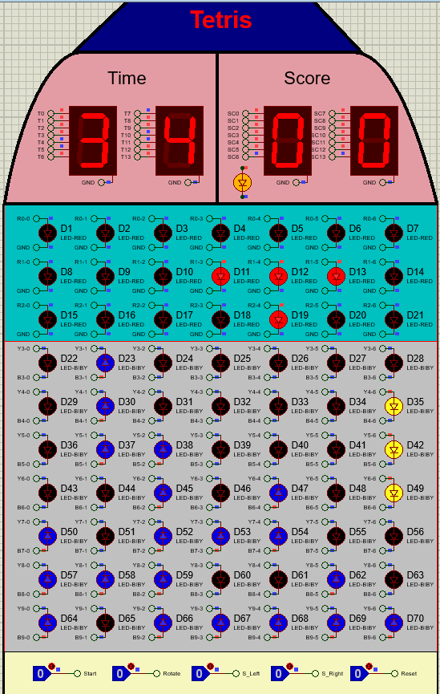

<h3 align="center" style="color:gold; font-size: 2rem;">Tetris (Digital Circuits Project) </h3>

## Introduction
This game is a digital block-stacking puzzle where the player's goal is to strategically guide and align falling blocks to complete rows within a limited time. The game is played on a 10x7 matrix, with blocks randomly generated in the top three rows. Players can control the position and orientation of these blocks using shift and rotation keys.

As rows are completed, they will flash for two seconds before being cleared, causing all blocks above them to shift downward. Players earn points for each cleared row, with the aim of reaching a total of three points to win the game. However, the game ends if:

- A block collides with a fixed block in the top three rows and cannot move out of the area.
- The timer reaches 99 seconds. 

<b>This document explains the overall project, the idea behind its implementation, and the functionality of each section.</b>

## Table of Contents

- [Gameplay Overview](#gameplay-overview)
  - [General Rules and Interface Setup](#general-rules-and-interface-setup)
  - [Starting the Game](#starting-the-game)
  - [Player Interactions](#player-interactions)
  - [Objective of the Game](#objective-of-the-game)
  
- [Implementation Idea](#implementation-idea)
  - [Before Game Starts](#before-game-starts)
  - [Handling Game State](#handling-game-state)
  - [Game End Condition](#game-end-condition)
  - [Timer and Score](#timer-and-score)
  - [Generating a Random 3x3 Block](#generating-a-random-3x3-block)
  - [Control Generated Block](#control-generated-block)
  - [Shift down Generated Block](#shift-down-generated-block)
  - [Block Collision](#block-collision)
  - [Gaining Score](#gaining-score)
  - [Fullboard Condition](#fullboard-condition)
  - [Notes](#notes)
- [Installation](#installation)
- [Running the Game](#running-the-game)
- [Resources](#resources)
- [License](#license)
- [Contact](#contact)

## Gameplay Overview

### General Rules and Interface Setup
The game interface consists of an 10x7 grid of LED , four seven segment responsible for displaying time and score and five control buttons which are Start , Reset , Rotate , S_Right and S_Left.

In the interface, each LED can either be on or off. The LEDs in the first three rows, when lit, are red, while the LEDs in rows four to ten can be either yellow or blue.

Yellow LEDs indicate a moving block, whereas blue LEDs represent a fixed block. If any part of a moving block collides with the bottom of the grid or with a fixed block, the entire moving block becomes fixed at the point of collision.

#### End Condition:

**Winning Condition:** The player wins by successfully collecting 3 points.

**Losing Conditions:**
1. The player loses if a generated block collides with a fixed block while exiting the top 3 rows and cannot fully leave the area.
2. The player loses if the game time reaches 99 seconds.

### Starting the Game

After pressing the start button, the game begins, and the time and score values on the 7-segment displays reset to zero. One of the eight predefined 3x3 blocks is randomly generated and placed in a random position within the top three rows. 

For the first three seconds, while the block is still in the top three rows, the player can use the shift and rotate buttons to change the block's position and orientation. Once the block completely moves out of the top three rows, a new block is generated, and this process continues until the game ends.

### Player Interactions

- **Reset:** Clicking this option resets the game and user interface to a ready state.

- **Start:** Clicking this option starts the game, resets the score and time displays to zero, and initiates the random generation of blocks. This button is only active when the game has been reset and is ready to start.

- **Rotate:** When this key is pressed, the block in the top three rows rotates counterclockwise.

- **S_Right:** When the key is pressed, the block in the top three rows shifts right, if possible.

- **S_Left:** When the key is pressed, the block in the top three rows shifts left, if possible.

### Objective of the Game

The objective of the game is to arrange the blocks so they align in a single row. When a row of LEDs is completed, all the LEDs in that row will blink for two seconds before turning off. After that, all the blocks above the completed row will shift downward, and the player will receive one point added to their total score. The player wins by accumulating 3 points.

## Implementation Idea

### Before Game Starts

### Handling Game State

### Game End Condition

### Timer and Score

### Generating a Random 3x3 Block

### Control Generated Block

### Shift down Generated Block

### Block Collision

### Gaining Score

### Fullboard Condition

### Notes

## Installation

## Running the Game

## Resources

## License

## Contact

