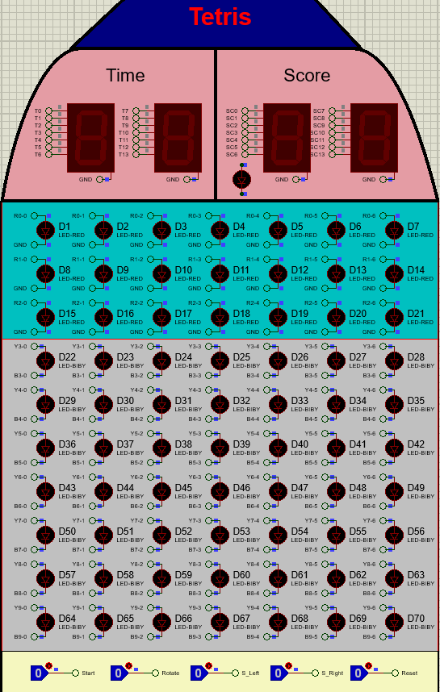

<h3 align="center">Tetris (Digital Circuits Project Implemented In Proteus) </h3>

## Introduction
This game is a digital block-stacking puzzle where the player's goal is to strategically guide and align falling blocks to complete rows within a limited time. The game is played on a 10x7 matrix, with blocks randomly generated in the top three rows. Players can control the position and orientation of these blocks using shift and rotation keys.

As rows are completed, they will flash for two seconds before being cleared, causing all blocks above them to shift downward. Players earn points for each cleared row, with the aim of reaching a total of three points to win the game. However, the game ends if:

- A block collides with a fixed block in the top three rows and cannot move out of the area.
- The timer reaches 99 seconds. 

<b>This document explains the overall project, the idea behind its implementation, and the functionality of each section.</b>


## Table of Contents

- [Gameplay Overview](#gameplay-overview)
  - [General Rules and Interface Setup](#general-rules-and-interface-setup)
  - [Starting the Game](#starting-the-game)
  - [Player Interactions](#player-interactions)
  - [Objective of the Game](#objective-of-the-game)
  
- [Implementation Idea](#implementation-idea)
  - [Before Game Starts](#before-game-starts)
  - [Game State Management](#game-state-management)
  - [Game End Condition](#game-end-condition)
  - [Timer and Score](#timer-and-score)
  - [Generating a Random 3x3 Block](#generating-a-random-3x3-block)
  - [Control Generated Block](#control-generated-block)
  - [Shift down Generated Block](#shift-down-generated-block)
  - [Block Collision](#block-collision)
  - [Gaining Score](#gaining-score)
  - [Fullboard Condition](#fullboard-condition)
  - [Notes](#notes)
- [Installation](#installation)
- [Running the Game](#running-the-game)
- [Resources](#resources)
- [License](#license)
- [Contact](#contact)


## Gameplay Overview

### General Rules and Interface Setup
The game interface consists of an 10x7 grid of LED , four seven segment responsible for displaying time and score and five control buttons which are Start , Reset , Rotate , S_Right and S_Left.

In the interface, each LED can either be on or off. The LEDs in the first three rows, when lit, are red, while the LEDs in rows four to ten can be either yellow or blue.

Yellow LEDs indicate a moving block, whereas blue LEDs represent a fixed block. If any part of a moving block collides with the bottom of the grid or with a fixed block, the entire moving block becomes fixed at the point of collision.

#### End Condition:

**Winning Condition:** The player wins by successfully collecting 3 points.

**Losing Conditions:**
1. The player loses if a generated block collides with a fixed block while exiting the top 3 rows and cannot fully leave the area.
2. The player loses if the game time reaches 99 seconds.

### Starting the Game

After pressing the start button, the game begins, and the time and score values on the 7-segment displays reset to zero. One of the eight predefined 3x3 blocks is randomly generated and placed in a random position within the top three rows. (All eight predefined 3x3 blocks are displayed in the picture below.) 


For the first three seconds, while the block is still in the top three rows, the player can use the shift and rotate buttons to change the block's position and orientation. Once the block completely moves out of the top three rows, a new block is generated, and this process continues until the game ends.

### Player Interactions

- **Reset:** Clicking this option resets the game and user interface to a ready state.

- **Start:** Clicking this option starts the game, resets the score and time displays to zero, and initiates the random generation of blocks. This button is only active when the game has been reset and is ready to start.

- **Rotate:** When this key is pressed, the block in the top three rows rotates counterclockwise.

- **S_Right:** When the key is pressed, the block in the top three rows shifts right, if possible.

- **S_Left:** When the key is pressed, the block in the top three rows shifts left, if possible.

### Objective of the Game

The objective of the game is to arrange the blocks so they align in a single row. When a row of LEDs is completed, all the LEDs in that row will blink for two seconds before turning off. After that, all the blocks above the completed row will shift downward, and the player will receive one point added to their total score. The player wins by accumulating 3 points.

# Implementation Idea

## Before Game Starts
After running the simulation and before pressing the start button, the last two digits of the student ID numbers of the two project group members will alternately blink on the four 7-segment displays.

At the same time, the LEDs on the game matrix will illuminate in a spiral pattern from top to bottom, creating an effect similar to a light show. Please see the video below for demonstration. This adds a visually engaging prelude to the game.

[](resources/before_game_starts.mp4)

<b>To simplify and enhance understanding, from now on we will  refer to 'LEDs' as 'lights'.</b><br>
Our implementation approach for this section is clear and systematic:

### Blinking Student ID Digits on 7-Segment Displays

**BCD to 7-Segment Conversion:**

To display the digits of student IDs on four 7-segment displays, we connect a BCD-to-7-segment decoder to each display. The input to each decoder consists of the BCD representation of the corresponding digit from the student ID.

**Blinking Mechanism:**

The outputs of the decoders, which are connected to the 7-segment displays, pass through a tri-state buffer. The enable condition of the tri-state buffer is controlled by an AND gate that combines the following signals:

1. **Game Not Started:** This ensures that the blinking occurs only before the game begins.
2. **2 Hz Clock Signal:** This clock alternates the buffer's enable state every 0.5 seconds, toggling the display output on and off.

This setup creates a blinking effect on the digits of the 7-segment displays.

### Light Show (Spiral Pattern)

**Shift Registers for Light Control:**

We employ several shift registers to control the lights in a spiral pattern from top to bottom. The input to the serial shift registers is set to 1 to simulate sequentially lighting up each light.

**Operation:**

Before the game begins, the shift registers sequentially shift a '1' through the lights, creating the spiral lighting effect. Once all the lights are illuminated, the shift registers are reset, and the process repeats until the game starts.

**Condition for Operation:**

The shift registers remain active as long as the game has not started. Once the game begins, the enabling condition for the shift registers is invalidated, thus stopping the light show.

## Game State Management

To manage the state of the game, we utilize two variables: GameStartState and GameEndState. As their names suggest:

- **GameStartState = 1**: This indicates that the game has started, meaning the player has clicked the Start button.
- **GameEndState = 1**: This indicates that the game has ended, whether the player won or lost.

### Functionality of the States:

**GameStartState**:
- When the Start button is pressed, a value of 1 is loaded into the register associated with the GameStartState output.
- This register is reset only when the Reset button is pressed.

**GameEndState**:
- The value of GameEndState is determined by the XOR operation applied to two variables: GameWon and GameLost. 
- These variables are explained in further detail in the section on [Game End Conditions](#game-end-condition).

### Game State Table

| GameStartState | GameEndState | Description                                        |
|-----------------|---------------|----------------------------------------------------|
| 0               | X             | The game has not started.                         |
| 1               | 0             | The game has started but not yet ended.          |
| 1               | 1             | The game has started and has ended.              |

### Controlling Circuit Activities

Using these two variables (GameStartState and GameEndState), we can effectively control the operation of the circuits for each part of the game:

- **When GameStartState = 0**, pre-start behaviors such as a blinking display and light show are active.
- **When GameStartState = 1** and GameEndState = 0, the game logic, block movement, and player interactions are active.
- **When GameEndState = 1**, post-game behaviors, such as displaying results, can be triggered.

This modular approach ensures clear control over the different stages of the game.

## Game End Condition
To track whether the player has won or lost, we define two variables: **GameWon** and **GameLost**. These variables indicate the player's win or loss status and are stored in a register. Here’s how their values are managed:

### Reset Condition
Both variables are reset to 0 when the **Reset** button is pressed.

### Load Condition
- **GameWon** is set to 1 when the **WinGame** signal is activated.
- **GameLost** is set to 1 when the **LoseGame** signal is activated.

These signals are generated based on the game’s win and loss conditions.

### Win Condition
The player wins if they collect 3 points.

The player’s score is displayed on the interface using two 7-segment displays, representing the score as an 8-bit BCD (Binary-Coded Decimal) value. A comparator circuit compares this 8-bit BCD value with **0110** (the binary representation of 3). If the comparator output indicates "greater than or equal to 3," the **WinGame** signal is set to 1. This activates the **GameWon** variable, marking the game as won and ending it.

### Loss Conditions

A player loses the game if either of the following conditions is met:

**Collision in the Top 3 Rows (FullBoard Condition):**

If a newly generated 3x3 block collides with a fixed block and cannot completely move out of the top three rows, a variable named **FullBoard** is set to 1. 

When **FullBoard** equals 1, the **LoseGame** signal is triggered, which sets **GameLost** to 1 and ends the game. 

Details on how **FullBoard** is determined can be found in the [FullBoard Condition](#fullboard-condition) section.

### Timer Reaches 99 Seconds

The game timer is represented as an 8-bit BCD (Binary-Coded Decimal) value. To detect when the timer reaches 99 seconds, the following condition is checked:

```
If we let 8 BCD Timer bits be T0...T7:
( (T0)AND(NOT(T1))AND(NOT(T2))AND(T3) ) 
AND
( (T4)AND(NOT(T5))AND(NOT(T6))AND(T7) )
```

If this condition evaluates to true, the `LoseGame` signal is triggered, resulting in `GameLost` being set to 1 and the game ending.

### Combining Loss Conditions

The `LoseGame` signal is determined based on the following conditions:

```
LoseGame = FullBoard OR (BCD Timer AND 1001 1001)
```

This means the game will be marked as lost if either the board is full or the timer has reached 99 seconds.

To ensure these loss conditions only apply after the game has started, we finalize the `LoseGame` condition by ANDing it with the `GameStartState`:

```
LoseGame = (FullBoard OR (BCD Timer AND 1001 1001)) AND GameStartState
```

### Summary of Logic

| Condition                    | Signal Triggered      | Result                            |
|------------------------------|----------------------|-----------------------------------|
| Score >= 3                   | WinGame = 1         | GameWon = 1 (End Game)           |
| Collision in top 3 rows      | FullBoard = 1       | GameLost = 1 (End Game)          |
| Timer reaches 99 seconds     | Timer AND 1001 1001 | GameLost = 1 (End Game)          |

## Timer and Score

To display the game timer and player score, we use four 7-segment displays, each driven by a Binary-Coded Decimal (BCD) value, since humans naturally count in base-10. Below is a detailed implementation:

### Game Timer

The game timer counts the elapsed seconds and is displayed as two digits:

- **Units Place (0–9):** Controlled by Counter A.
- **Tens Place (0–9):** Controlled by Counter B.

**Implementation of Timer Counters**

**Counter A (Units):**

- **Clock Input:** A 1 Hz clock signal serves as the input.
- **Operation:** 
  - Counter A increments from 0 to 9.
  - When it reaches 9, it resets to 0 on the next clock edge.
  - When Counter A resets, Counter B increments by 1.

**Counter B (Tens):**

- **Clock Input:** Triggered whenever Counter A resets after reaching 9.
- **Operation:**
  - Counter B increments from 0 to 9.

**Output:**

The combined output of Counter A and Counter B forms an 8-bit BCD value representing the timer:

**Timer Output = Counter B (MSB) | Counter A (LSB)**

**Connection to 7-Segment Displays:**

The 8-bit BCD output is sent to BCD-to-7-segment decoders. To control when the timer is displayed, we use tri-state buffers with the following enable condition:

```
GameStartState AND NOT(GameEndState)
```

This condition ensures the timer is displayed only when the game is active (i.e., when it has started but not yet ended).

### Player Score

The player score is displayed using a similar structure to the timer, with a few key differences:

**Clock Input for Counter A (Units):**

- Instead of a 1 Hz clock, Counter A utilizes a signal known as AddScore as its clock input.

**AddScore:**
- The AddScore signal becomes active (1) whenever the player successfully clears a complete row of lights.
- Further details about this signal are provided in the [Gaining Score](#gaining-score) section.

**Operation:**
- Counter A increments each time it receives an AddScore pulse.
- When Counter A reaches a value of 9, it resets to 0 and increments Counter B, similar to how the timer counters operate.

**Output and Display:**
- The combined output of Counter A and Counter B forms the 8-bit BCD (Binary-Coded Decimal) score value.
- This output is sent to the BCD-to-7-segment decoders, which are controlled by tri-state buffers. The enable condition for these buffers is the same as that for the timer: 
```
GameStartState AND NOT(GameEndState)
```
This ensures a clear and logical display of the game timer and player score.

## Generating a Random 3x3 Block

## Control Generated Block

## Shift down Generated Block

## Block Collision

## Gaining Score

## Fullboard Condition

## Notes

## Installation

## Running the Game

## Resources

## License

## Contact


